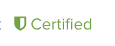

# Certified and Uncertified Apps

You may have noticed the Certified banner that shows up next to some Phantom Apps.  This document explains what goes into that icon.  

Uncertified App  | Certified App
------------- | -------------
Code Review  | *
Security Review  | *
Content Review  | *
Passive Testing  | *
- | Full Functionality Testing
- | Regular Regression Testing	

## Uncertified App Testing 
	
### Code Review
A code review is conducted by the Phantom App team.  

### Security Review
A security review is conducted by a Splunk Security team. The security review ensures no malicious code, libraries, or other content is published through the Phantom app listings.

### Content Review
A content review is conducted by the Phantom App team.  Common checks include:

* Would this update break existing user workflows?
* Is this update something that all users of the app can take advantage of?
* Does the update leverage an officially supported API on the partner product?
* Does this update expose functionality that is excessively difficult to use or understand?

### Passive Testing
The Phantom App team conducts "passive" tests which do not require access to the product integrated to by the app.

For example:

* Does the app implement the required "test connectivity" action?
* Does the app properly handle exceptions?

## Certified App Testing
The main differentiating factor of a Certified app is that it has been fully tested against a functional version of the product the app integrates with.  

### Full Functionality Testing
Fort a Certified app, the Phantom QA team tests every action exposed by the app against a working version of the product.  

### Regular Regression Testing
As part of the Certified app testing process, the Phantom QA team produces a Phantom Playbook that tests for app functionality.  This test is in turn used to perform regular regression testing of all Certified Phantom Apps.
