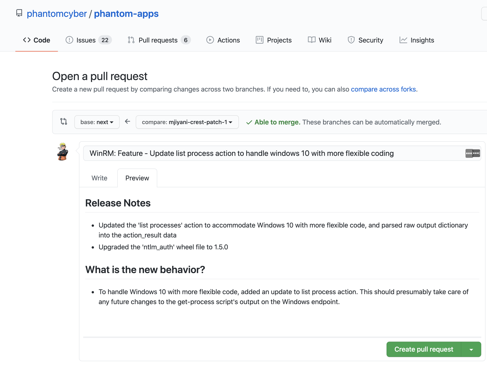

# Step-by-Step Guide for Contributing to Phantom Apps

## Step 1: Create a GitHub Issue

1. If one does not already exist, create an Issue (otherwise we'll use the existing one)
1. GitHub will prompt you to either create a **Bug report** or **Feature request**. Choose whichever applies to you
1. Fill out the issue with as many details as you see fit

## Step 2: Connect to GitHub with SSH

1. Due to security reasons, you may only be able to fork and clone the phantom-apps repo with SSH
2. Follow this [guide](https://help.github.com/en/articles/connecting-to-github-with-ssh) for instructions on connecting to GitHub with SSH

## Step 3: Fork the [phantom-apps](https://github.com/phantomcyber/phantom-apps) repo

1. This will create a copy of the phantom-apps repo under your GitHub account
1. With your fork, you will be able to make changes or additions and open up pull requests to the main phantom-apps repo

## Step 4: Clone your forked repo locally

1. In order to start working on an app, you must clone your forked phantom-apps repo locally
1. Using the SSH clone key, perform the following commands on your command-line interface:

  ```
  # Clone your forked repo 
  $ git clone git@github.com:your-username/phantom-apps.git
  
  # Set the main phantom-apps repo as the upstream
  $ git remote add upstream git@github.com:phantomcyber/phantom-apps.git 
  
  # Sync with the latest changes on the upstream's next branch
  $ git checkout next
  $ git pull upstream next
  ``` 
  
## Step 5: Actually making a contribution

1. Now that you have cloned your fork and synced up with the main upstream repo, you are ready to start working!
1. Perform the following commands to start working on your issue:

  ```
  # Create a working branch off of the next branch
  $ git checkout -b your-branch
  
  # Once you are finished with your changes/additions
  $ git add .
  $ git commit -m "Commit message here"
  $ git push origin your-branch
  
  ``` 
 ## Step 6: Finally, create a **Pull Request** on GitHub
 
 1. The final step is to create a pull request from `your-username/phantom-apps:your-branch` into `phantomcyber/phantom-apps:next` for the Splunk>Phantom Engineering team to review your code changes and provide feedback
 1. In order for the Splunk>Phantom team to properly aid you in the PR process, please make sure to check the 'Allow edits and access to secrets by maintainers' box which is shown in the image below.
 1. Please ensure your pull request adheres to the guidelines mentioned in [PULL REQUEST TEMPLATE](https://github.com/phantomcyber/phantom-apps/blob/next/.github/pull_request_template.md).
 

 ---

