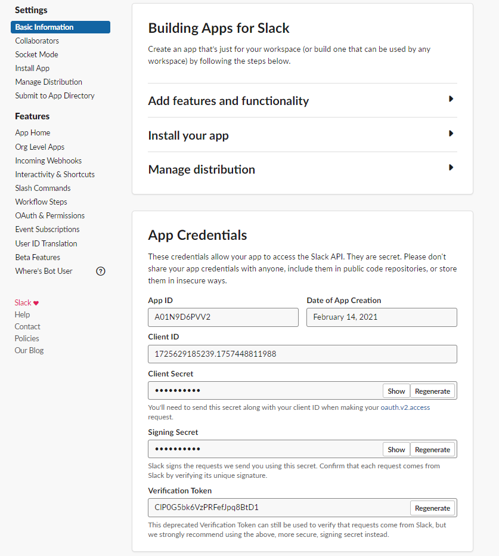
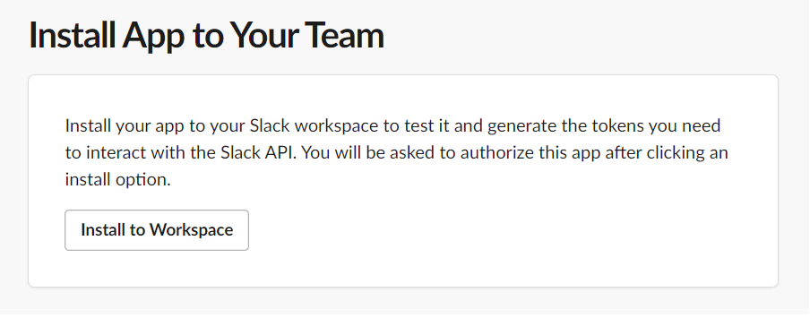
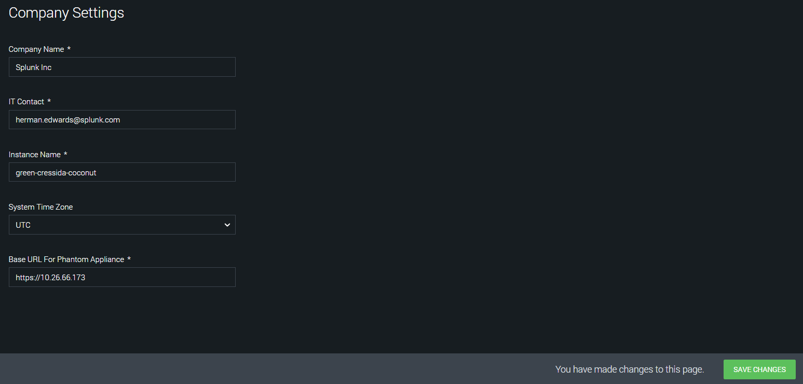
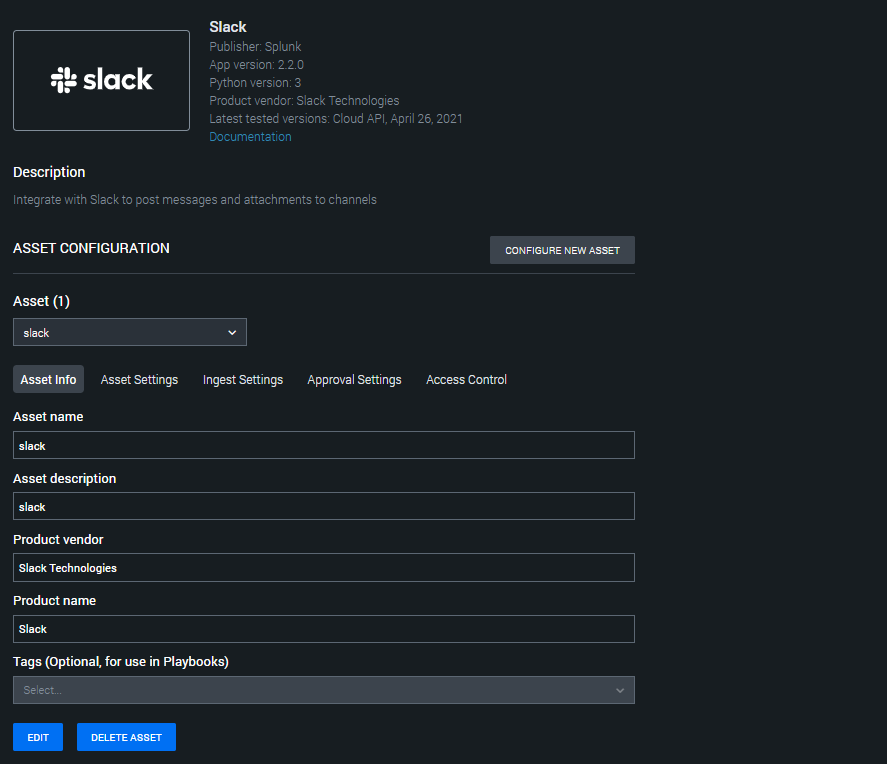
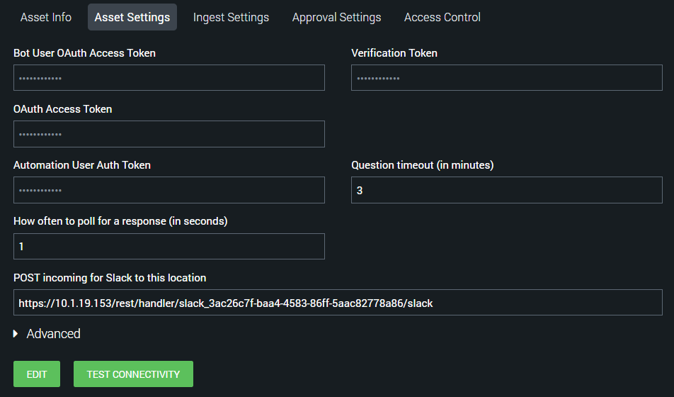
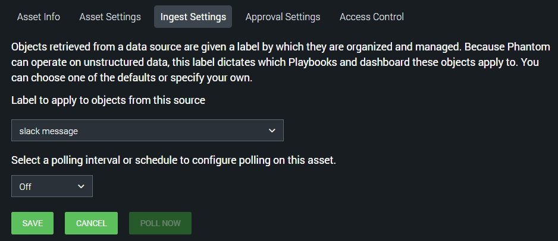
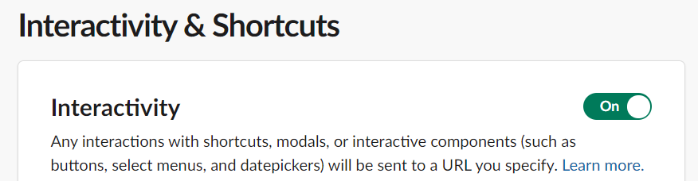
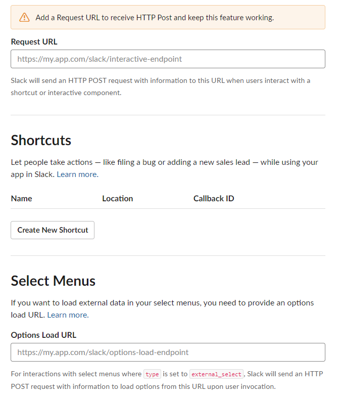

[comment]: # " File: readme.md"
[comment]: # "  Copyright (c) 2016-2021 Splunk Inc."
[comment]: # ""
[comment]: # "  Licensed under Apache 2.0 (https://www.apache.org/licenses/LICENSE-2.0.txt)"
[comment]: # ""
## Playbook Backward Compatibility

-   The existing action parameters have been modified for the actions given below. Hence, it is
    requested to the end-user to please update their existing playbooks by re-inserting \| modifying
    \| deleting the corresponding action blocks or by providing appropriate values to these action
    parameters to ensure the correct functioning of the playbooks created on the earlier versions of
    the app.

      

    -   Upload File - 4 new action parameters 'filename', 'content', 'parent_message_ts' and
        'filetype' are added which helps to add the file without specifying vault ID in 'file'
        parameter. The 'parent_message_ts' can be used to reply in the thread based on the timestamp
        of the parent message.

    <!-- -->

    -   Send Message - 2 new action parameters 'reply_broadcast' and 'parent_message_ts' are added
        which can be used to reply in the thread based on the timestamp of the parent message.

-   New action 'Add Reaction' has been added. Hence, it is requested to the end-user to please
    update their existing playbooks by inserting the corresponding action blocks for this action on
    the earlier versions of the app.

## Authentication

Phantom's Slack App needs a bot token to read messages from and post messages to slack channels. The
app also needs a verification token to verify POST requests received from Slack.

### Create a Slack App

Creating a Slack App is required to get the proper bot token for authenticating the Phantom Slack
App. To do this, go to <https://api.slack.com/apps> in a browser, and select **Create New App** .  
  
  
  
In the pop up window, give the app name and associate it with a Slack team/your Workspace, then
click **Create App** .  
  
  
  
On the next page, there is a **Verification Token** . This token will be needed during asset
configuration.  
  
  
  
In the menu bar on the left, select **OAuth & Permissions** . On that page, Scroll down to the
**Scopes** section and click **Add an OAuth Scope** to add scopes to your **Bot Token** and **User
Token** .  
  
  
  
Next, click on **Install App** in the side bar. On that page, click **Install to Workspace** .  
  
  
  
On the next page, click **Allow** .  
  
  
  
After authorizing the app, the next window will show the app's authorization tokens. The **Bot User
OAuth Access Token** and **OAuth Access Token** will be required during asset configuration.  
  

## Phantom Base URL

The app uses the Phantom **Base URL** configuration to generate links to actions, so please make
sure a valid url is specified in the **System Settings** .  
  

## Phantom Slack Asset

Fill out the required values in the **Asset Definition** tab.  
  
  
  
Fill out the **Bot User OAuth Access Token** , **OAuth Access Token** and **Verification Token** in
the **Asset Settings** tab.  
  
  
  
Click **SAVE** , you will be asked to fill in the **Ingest Settings** , select one of the labels
from the drop-down or you can create a new one and Click **SAVE** .  
  
  
  
After saving the asset, go back to the **Asset Settings** tab. There will now be a box labeled
**POST incoming for Slack to this location** . This URL will be used later when configuring Slack's
**Interactive Messages** functionality.  
  

### Automation User

The Slack app needs a Phantom authentication token to perform some tasks on the Phantom platform. To
get this token, it is recommended that you create a new automation user. The steps for creating this
user are as follows:

-   On the Phantom platform, navigate to **Administration->User Management**

-   Under **Users** , click **+ USER**

-   In the **Add User** wizard, do the following:

      

    -   Set the **User Type** to **Automation**
    -   Give the user a **Username** like "Slack Automation"
    -   Set **Allowed IPs** to **127.0.0.1**
    -   Set the **Default Label** to the label seen in the Slack asset's **Ingest Settings**
    -   Under **Roles** , in addition to the default **Automation** role, add the **Observer** role
    -   Click **CREATE**

      
      

-   Once the new user is created, click on the user in the user list

-   On the user's page copy the **ph-auth-token** field from the **Authorization Configuration for
    REST API** box

      
      
      

-   Paste the copied token in the **Automation User Auth Token** on the Slack app's **Asset
    Settings** page

### Test Connectivity

Now, on the **Asset Settings** page, click the **TEST CONNECTIVITY** button, which will display a
text box with progress messages. It will show the bot username and bot user ID that Phantom received
from Slack. Please ensure that these are correct.  
  

### Interactive Messages

In order for Phantom to receive responses to questions from Slack, the functionality needs to be
configured. But first, you will need to create a user to allow Slack to authenticate with Phantom
(This user is separate from the automation user created above).  
  
Navigate back to the **Users** tab in **Administration** , and click on **+ USER** .  
  
  
  
In the pop-up window, select the User Type **Local** . Fill out the required username and password
fields. For security reasons DO NOT give the user any roles. This user should only be used to
authenticate POST requests from Slack to Phantom.  
  

## Set up Interactivity in Slack

Go to the **Your apps** option in Slack. From the menu on the left select the **Interactivity &
Shortcuts** option.  
  
NOTE: Slack will only send POST requests to endpoints that have an SSL certificate signed by a
certificate authority.  
  
  
  
Once on this page, toggle on **Interactivity** .  
  
  
  
In the **Request URL** text box, add the **POST incoming for Slack to this location** URL found in
the **Asset Settings** window. Before saving these changes, add the username and password of the new
user added to Phantom. The URL should end up in the format:  
  
https://\<username>:\<password>@\<phantom_hostname>/rest/handler/slack_3ac26c7f-baa4-4583-86ff-5aac82778a86/slack
After adding the full URL, click **Enable Interactive Messages**

## Slack Bot

### Ingest Settings

To run the Phantom SlackBot that will get Phantom to take commands from Slack, ingestion needs to be
enabled on the Phantom Slack Asset. To do this go back to the INGEST SETTINGS tab and enable polling
and specify the Polling interval as 10 minutes. The "Label to apply to objects from this source"
setting is ignored by this app, so it can be set to anything.  
  
  
  
To check the status of the phantom bot and restart it if not running, you can Click POLL NOW from
the INGEST SETTINGS app and then POLL NOW again. The "Source ID", "Maximum containers", and "Maximum
artifacts" settings can be ignored in this case.  
  
  
  
The POLL NOW window will display the PID of the SlackBot process as well as the number of artifacts
and containers ingested (which will always be zero for this app).  
  

### Stopping SlackBot

Once the Phantom SlackBot starts running, the **stop bot** action needs to be run to stop it. Simply
disabling ingestion won't stop SlackBot.  
WARNING: Stopping SlackBot is required before upgrading or uninstalling the Phantom Slack App or
else an untracked SlackBot process may be left running on the Phantom instance. In addition,
deleting a Slack asset that has SlackBot running will result in SlackBot continuing to run,
untracked.  
  

## Slack Commands

Once a Slack asset has been configured, and SlackBot is running on Phantom, it needs to be invited
to the channel, and then commands from Slack can be received by Phantom. In Slack, just mention the
bot to get a help message on running commands. All commands follow this syntax:  
  

@BOT_NAME COMMAND COMMAND_PARAMETERS

  

### Running Actions

To run an action on Phantom from Slack, use the **act** command. The syntax of which is:  
  

    @BOT_NAME act ACTION_NAME [--container CONTAINER_ID] [--asset ASSET] [--name NAME]
        [--type TYPE] [--parameters PARAMETER:VALUE [PARAMETER:VALUE]*]

    required parameters:
      ACTION_NAME       The name of the action to run on Phantom
      --container       ID of the container to run the action on

    optional parameters:
      --name            Set a name for the action (defaults to 'Slack generated action')
      --type            Set the type of the action (defaults to 'phantombot')
      --asset           Name or ID of the asset to run the action on
                        If no asset is specified, the given action will run on all possible assets
      --parameters      List of parameter/value pairs in the format
                        param1:value1 param2:value2...

    examples:
      To run the action "list channels" on container 123 using the "slack" asset:

        @phantombot act "list channels" --container 123 --asset slack

      To run the action "whois ip" on 1.1.1.1 using the "whois" asset:

        @phantombot act "whois ip" --container 123 --asset whois --parameters ip:1.1.1.1

      To run all possible "whois ip" actions on 1.1.1.1 using all assets that support the action, and giving it the name "All WhoIs":

        @phantombot act "whois ip" --container 123 --parameters ip:1.1.1.1 --name "All WhoIs"

  
After receiving an **act** command, SlackBot will kick off the action and send a link to the action
page to Slack. When the action is complete, SlackBot will send a summary of the action results to
Slack. If multiple actions are run at once, SlackBot will send action results for each action
separately as each action completes.  

### Running Playbooks

To run a playbook on Phantom from Slack, use the **run_playbook** command. The syntax of which is:  
  

    @BOT_NAME run_playbook [--repo REPO] PLAYBOOK CONTAINER_ID

    required parameters:
      PLAYBOOK          Name or ID of the playbook to run
      CONTAINER_ID      ID of container to run the playbook on

    optional parameters:
      --repo REPO       Name of the repo the playbook is in (required if the
                        playbook argument is a name and not an ID)"

    examples:
      To run the playbook "investigate" which is in the "community" repo, on container 123

        @phantombot run_playbook --repo community investigate 123

      To run the playbook with ID 32 on container 123:

        @phantombot run_playbook 32 123

  
After receiving a **run_playbook** command, SlackBot will kick off the playbook and send a link to
the container's mission control page to slack. When the playbook has finished running, SlackBot will
send a status report of the playbook's run to Slack.  

### Getting Container Information

To get information about a container, use the **get_container** command. The syntax of which is:  
  

    @BOT_NAME get_container [--container CONTAINER] [--tags TAG [TAG]*]

    parameters:
      --container       ID of the container to retrieve
      --tags            List of tags of containers to retrieve

    Only one of --container or --tags flags can be included at once
    Using the --tags flag will return a small summary of containers with the given tag.

    examples:
      To get information on container 123:

        @phantombot get_container 123

      To get a list of containers with the tag "my_tag"

        @phantombot get_container --tags my_tag

      To get a list of containers with one of the following tags: "tag1" "tag2" or "tag3"

        @phantombot get_container --tags tag1 tag2 tag3

Running a **get_container** command will result in SlackBot sending either a list of containers or a
set of information on one container to Slack.  

### Listing Actions or Containers

To get a list of actions or containers, use the **list** command. The syntax of which is:  
  

    @BOT_NAME list [actions|containers]

    parameters:
      object        name of an object to list can be 'actions' or 'containers'

    WARNING: If there are many containers on the system, the 'list containers' command can take a long time and can result in a lot of data being dumped on Slack

    examples:
      To get a list of all actions on the Phantom instance:

        @phantombot list actions

      To get a list of all containers on the Phantom instance:

        @phantombot list containers

Running a **list** command will result in SlackBot sending a list of either actions or containers to
Slack.  
